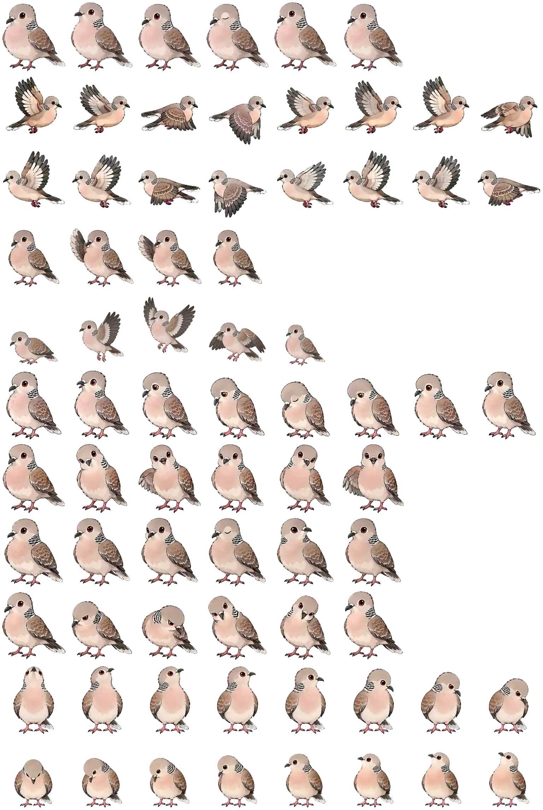

# 🐦 咕咕 Gugu — Codex Desktop Pet

**咕咕（Gugu）**是一只原创的山斑鸠 Codex 桌宠，会根据 Codex 的状态待机、飞行、等待、工作、庆祝，并会朝不同方向张望。

> An original Oriental turtle-dove companion for Codex Desktop.

<p align="center">
  
</p>

## ✨ 特点

- Codex Custom Pet V2
- 8 × 11 sprite atlas
- 单格尺寸：192 × 208 px
- 整张精灵图：1536 × 2288 px
- 包含待机、左右移动/飞行、挥翅、跳跃、失败、等待、工作、review 等状态
- 最后两行包含 16 个观察方向
- Windows / macOS / Linux 安装脚本

## 📦 安装

### Windows

下载或克隆本仓库后，在仓库目录运行：

```powershell
powershell -ExecutionPolicy Bypass -File .\install.ps1
```

也可以手动把：

```text
pets/gugu/pet.json
pets/gugu/spritesheet.webp
```

复制到：

```text
%USERPROFILE%\.codex\pets\gugu\
```

如果设置了 `CODEX_HOME`，则使用：

```text
%CODEX_HOME%\pets\gugu\
```

### macOS / Linux

```bash
chmod +x ./install.sh
./install.sh
```

或者手动复制到：

```text
~/.codex/pets/gugu/
```

安装后重新打开 Codex，在 Pets 设置中刷新并选择 **咕咕 Gugu**。

## 🗂️ 仓库结构

```text
Gugu-Codex-Pet/
├─ pets/
│  └─ gugu/
│     ├─ pet.json
│     └─ spritesheet.webp
├─ install.ps1
├─ install.sh
├─ LICENSE
└─ README.md
```

## 🎨 动作规格

| 行 | 状态 | 帧数 |
|---|---|---:|
| 0 | idle | 6 |
| 1 | running-right | 8 |
| 2 | running-left | 8 |
| 3 | waving | 4 |
| 4 | jumping | 5 |
| 5 | failed | 8 |
| 6 | waiting | 6 |
| 7 | running / working | 6 |
| 8 | review | 6 |
| 9–10 | 16-direction look | 16 |

## 🛠️ 二次创作

你可以 fork 本仓库并替换 `pets/gugu/spritesheet.webp` 来制作自己的版本。保持 V2 图集尺寸为 **1536 × 2288**、8 列 × 11 行，每格 **192 × 208**。

## 🤖 关于项目

咕咕最初由项目作者使用 ChatGPT 辅助设计与生成，之后整理为可分享的 Codex 自定义桌宠。

这是独立的社区项目，并非 OpenAI 官方项目，也不代表 OpenAI 的认可或背书。

## 📄 License

本项目以 **MIT License** 开源。欢迎使用、修改、二次创作和分享；请保留许可证及版权声明。

---

Made with 🐦 by **yzp39287-code**
